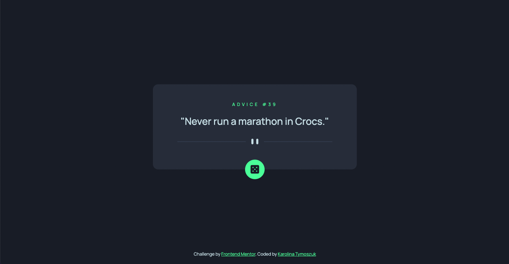

# Frontend Mentor - Advice generator app solution

This is a solution to the [Advice generator app challenge on Frontend Mentor](https://www.frontendmentor.io/challenges/advice-generator-app-QdUG-13db). Frontend Mentor challenges help you improve your coding skills by building realistic projects.

## Table of contents

- [Overview](#overview)
  - [The challenge](#the-challenge)
  - [Screenshot](#screenshot)
  - [Links](#links)
- [My process](#my-process)
  - [Built with](#built-with)
  - [What I learned](#what-i-learned)
  - [Continued development](#continued-development)
  - [Useful resources](#useful-resources)
- [Author](#author)
- [Acknowledgments](#acknowledgments)

**Note: Delete this note and update the table of contents based on what sections you keep.**

## Overview

### The challenge

Users should be able to:

- View the optimal layout for the app depending on their device's screen size
- See hover states for all interactive elements on the page
- Generate a new piece of advice by clicking the dice icon

### Screenshot



### Links

- Live Site URL: [Advice generator app](https://advice-generator-karolina.netlify.app/)

## My process

### Built with

- Semantic HTML5 markup
- CSS custom properties
- Pure JavaScript work
- Mobile-first workflow

### What I learned

Per questo progetto ho scelto di usare i linguaggi puri: html5, CSS e JavaScript. La sfida più grande è stata quella di far apparire il messaggio di inizio del 'gioco', per poi farlo sparire e far spazio ai consigli generati a partire dalla chiamata api.
Per questo ho deciso di usare le classi ".show" e ".hidden" nella funzione onclick sul dado

Di seguito ci sono alcuni passaggi del mio codice: 
- Il CSS che definisce il pulsante del dado
- La funzione che fa comparire i consigli al click

```html

```
```css
#dice {
    position: absolute;
    width: var(--dice-dimension);
    height: var(--dice-dimension);
    border-radius: 50%;
    border: none;
    background-color: var(--id-color);
    bottom: 0;
    transform: translateY(50%);
    transition: .7s;
}

#dice:hover {
    box-shadow: 0px 0px 30px 0px var(--id-color);
    transition: .7s;
}
```
```js
function clicked() {
    axios.get('https://api.adviceslip.com/advice')
    .then(function (response) {
        advice = response.data.slip;
        adviceId.innerHTML = advice.id;
        adviceContent.innerHTML = advice.advice;
    })

    adviceIdContainer.classList.add("show");
    adviceContentContainer.classList.add("show");
    adviceContentContainer.classList.add("pb");
    firstMessage.classList.remove("show");
    firstMessage.classList.add("hidden");
    firstMessage.classList.remove("pb");
    dividerDesktop.classList.remove("hidden");
    dividerDesktop.classList.add("show")
    dividerMobile.classList.remove("hidden");
    dividerMobile.classList.add("show")
}
```

### Continued development

Ora vorrei applicare più tecnologie imparate nei mesi precedenti, quindi farò pratica con VueJS e Bootstrap

### Useful resources
## Author

- Frontend Mentor - [@katy01101011](https://www.frontendmentor.io/profile/katy01101011)
- Linkedin - [@karolina-tymoszuk](https://www.linkedin.com/in/karolina-tymoszuk)

## Acknowledgments

Vorrei ringraziare Olga Demina che mi ha fatto conoscere questo sito e che è sempre pronta a dare una mano nel momento del bisogno
